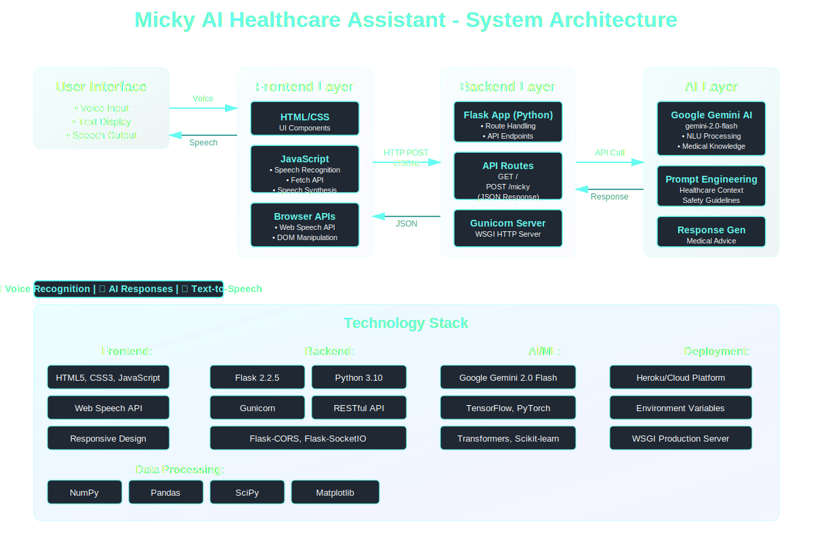

<div align="center">

# 🤖 Micky - AI Healthcare Assistant

[](https://www.python.org/)
[](https://flask.palletsprojects.com/)
[](https://ai.google.dev/)
[](https://www.tensorflow.org/)
[](https://pytorch.org/)

[](https://developer.mozilla.org/en-US/docs/Web/HTML)
[](https://developer.mozilla.org/en-US/docs/Web/CSS)
[](https://developer.mozilla.org/en-US/docs/Web/JavaScript)
[](https://gunicorn.org/)
[](https://www.heroku.com/)

[](https://numpy.org/)
[](https://pandas.pydata.org/)
[](https://scikit-learn.org/)
[](https://scipy.org/)

**An intelligent voice-enabled healthcare assistant powered by Google Gemini AI**

[Features](#-features) • [Architecture](#-architecture) • [Installation](#-installation) • [Usage](#-usage) • [API](#-api-documentation) • [Deployment](#-deployment)

</div>

---

## 📋 Overview

**Micky** is an AI-powered healthcare assistant that provides medically accurate advice through a natural voice interface. Built with Flask and powered by Google's Gemini 2.0 Flash model, Micky offers quick, safe, and actionable medical guidance for common health concerns.

### ✨ Key Highlights

- 🎤 **Voice Recognition**: Natural speech input using Web Speech API
- 🤖 **AI-Powered**: Leverages Google Gemini 2.0 Flash for intelligent responses
- 🔊 **Text-to-Speech**: Spoken responses for hands-free interaction
- ⚡ **Real-time**: Instant medical advice and recommendations
- 🛡️ **Safe & Ethical**: Designed with safety guidelines and ethical considerations
- 💊 **Medication Guidance**: Provides correct medication names and general dosages

---

## 🎯 Features

### Core Functionality
- **Voice-Activated Interface**: Interact with Micky using natural speech
- **Intelligent Medical Advice**: Get accurate information about symptoms, medications, and treatments
- **Concise Responses**: Short, medically sound answers (1-2 sentences)
- **Medication Recommendations**: Receive proper medication names with dosages
- **Interactive UI**: Beautiful, animated interface with visual feedback
- **Cross-Browser Support**: Works on all modern browsers supporting Web Speech API

### Healthcare Capabilities
- Common symptom analysis (headaches, fever, nausea, etc.)
- Medication recommendations for various conditions
- Home remedies and self-care advice
- First-aid guidance
- General health tips
- Safe and ethical medical information

---

## 🏗️ Architecture

Micky follows a modern three-tier architecture with a focus on AI integration:

<div align="center">
  
</div>

### System Components

#### 1. **Frontend Layer**
- **HTML/CSS**: Responsive UI with animated voice feedback
- **JavaScript**: Handles speech recognition, API calls, and text-to-speech
- **Web Speech API**: Browser-native voice recognition and synthesis

#### 2. **Backend Layer**
- **Flask Framework**: RESTful API server
- **Gunicorn**: Production WSGI HTTP server
- **Python 3.10**: Core application logic
- **API Routes**:
  - `GET /` - Serves the main interface
  - `POST /micky` - Processes voice queries and returns AI responses

#### 3. **AI Layer**
- **Google Gemini 2.0 Flash**: State-of-the-art language model
- **Prompt Engineering**: Specialized healthcare context and safety guidelines
- **Natural Language Understanding**: Processes user queries intelligently
- **Response Generation**: Produces medically accurate, concise advice

### Data Flow
```
User Voice Input → Web Speech API → JavaScript Frontend → 
Flask Backend → Google Gemini AI → Response Processing → 
Text-to-Speech → User
```

---

## 🚀 Installation

### Prerequisites
- Python 3.10 or higher
- pip (Python package manager)
- Google Gemini API Key ([Get one here](https://ai.google.dev/))

### Step 1: Clone the Repository
```bash
git clone https://github.com/lavansh1306/Micky.git
cd Micky
```

### Step 2: Create Virtual Environment (Recommended)
```bash
python -m venv venv

# On Windows
venv\Scripts\activate

# On macOS/Linux
source venv/bin/activate
```

### Step 3: Install Dependencies
```bash
pip install -r requirements.txt
```

### Step 4: Set Environment Variables
Create a `.env` file in the root directory or set environment variables:

```bash
# .env file
GEMINI_API_KEY=your_gemini_api_key_here
PORT=8080
```

Or export directly:
```bash
export GEMINI_API_KEY="your_gemini_api_key_here"
export PORT=8080
```

### Step 5: Run the Application
```bash
# Development mode
python app.py

# Production mode with Gunicorn
gunicorn -b 0.0.0.0:8080 app:app
```

The application will be available at `http://localhost:8080`

---

## 💻 Usage

### Web Interface

1. **Open your browser** and navigate to `http://localhost:8080`
2. **Click "Talk to Micky"** button to activate voice input
3. **Speak your health query** (e.g., "I have a headache and nausea")
4. **Wait for Micky's response** - displayed as text and spoken aloud
5. **Click "Stop Micky"** to end the conversation

### Example Queries

- "I have a headache and nausea"
- "What should I do for a fever?"
- "I feel anxious, what helps?"
- "What medicine works for cold and cough?"
- "I have acid reflux, what should I take?"
- "What should I do for food poisoning?"

### Sample Responses

**User**: "I have a headache and nausea."  
**Micky**: "Take paracetamol 500mg, stay hydrated, and rest in a dark room."

**User**: "I have a fever, what should I do?"  
**Micky**: "Take paracetamol 650mg every 6 hours, drink fluids, and monitor your temperature."

**User**: "What medicine works for cold and cough?"  
**Micky**: "Take cetirizine 10mg for allergies, dextromethorphan for cough, and drink warm fluids."

---

## 📡 API Documentation

### POST /micky

Process a user health query and return AI-generated medical advice.

**Endpoint**: `POST /micky`

**Request Body**:
```json
{
  "query": "I have a headache"
}
```

**Response**:
```json
{
  "response": "Take paracetamol 500mg, stay hydrated, and rest in a dark room."
}
```

**Headers**:
- `Content-Type: application/json`

**Status Codes**:
- `200 OK`: Successful response
- `400 Bad Request`: Invalid request format
- `500 Internal Server Error`: Server or AI processing error

### GET /

Serves the main HTML interface.

**Endpoint**: `GET /`

**Response**: HTML page with Micky interface

---

## 🛠️ Technology Stack

### Backend
- **Flask 2.2.5**: Micro web framework
- **Gunicorn 21.2.0**: WSGI HTTP server
- **Python 3.10**: Programming language
- **google-generativeai**: Gemini AI SDK

### AI/ML Libraries
- **TensorFlow 2.14+**: Deep learning framework
- **PyTorch**: Machine learning library
- **Transformers**: Hugging Face transformers
- **scikit-learn**: Machine learning utilities
- **NumPy**: Numerical computing
- **Pandas**: Data manipulation
- **SciPy**: Scientific computing
- **Matplotlib**: Data visualization

### Frontend
- **HTML5**: Markup language
- **CSS3**: Styling with custom animations
- **JavaScript (ES6+)**: Client-side logic
- **Web Speech API**: Voice recognition and synthesis

### Additional Tools
- **Flask-CORS**: Cross-origin resource sharing
- **Flask-SocketIO**: WebSocket support
- **Requests**: HTTP library
- **Protobuf**: Data serialization

---

## 🌐 Deployment

### Heroku Deployment

The application is ready for deployment on Heroku with included configuration files.

**Files**:
- `Procfile`: Defines the web process
- `runtime.txt`: Specifies Python version
- `requirements.txt`: Lists all dependencies

**Steps**:

1. **Install Heroku CLI** ([Download](https://devcenter.heroku.com/articles/heroku-cli))

2. **Login to Heroku**:
```bash
heroku login
```

3. **Create a new Heroku app**:
```bash
heroku create your-app-name
```

4. **Set environment variables**:
```bash
heroku config:set GEMINI_API_KEY=your_gemini_api_key
```

5. **Deploy**:
```bash
git push heroku main
```

6. **Open your app**:
```bash
heroku open
```

### Other Platforms

Micky can be deployed to any platform supporting Python applications:
- **Google Cloud Platform**: App Engine, Cloud Run
- **AWS**: Elastic Beanstalk, Lambda
- **Azure**: App Service
- **DigitalOcean**: App Platform
- **Railway**: Simple deployment
- **Render**: Easy hosting

---

## ⚙️ Environment Variables

| Variable | Description | Required | Default |
|----------|-------------|----------|---------|
| `GEMINI_API_KEY` | Google Gemini API key for AI responses | Yes | None |
| `PORT` | Port number for the application | No | 8080 |

---

## 📁 Project Structure

```
Micky/
├── app.py                  # Main Flask application
├── requirements.txt        # Python dependencies
├── runtime.txt            # Python version specification
├── Procfile               # Heroku deployment configuration
├── README.md              # Project documentation
├── docs/
│   └── architecture.svg   # System architecture diagram
├── templates/
│   └── index.html         # Main HTML interface
└── static/
    ├── css/
    │   └── styles.css     # Styling and animations
    └── js/
        └── script.js      # Frontend JavaScript logic
```

---

## 🔒 Security & Privacy

- **No Data Storage**: Micky doesn't store any user health data
- **API Key Security**: Environment variables protect sensitive credentials
- **Ethical Guidelines**: Built-in safety rules prevent harmful advice
- **No Controlled Substances**: Doesn't prescribe dangerous medications
- **User Privacy**: All interactions are private and not logged

---

## ⚠️ Disclaimer

**Important**: Micky is an AI assistant designed to provide general health information and is **not a substitute for professional medical advice, diagnosis, or treatment**. Always seek the advice of your physician or other qualified health provider with any questions you may have regarding a medical condition.

---

## 🤝 Contributing

Contributions are welcome! Here's how you can help:

1. **Fork the repository**
2. **Create a feature branch**: `git checkout -b feature/amazing-feature`
3. **Commit your changes**: `git commit -m 'Add amazing feature'`
4. **Push to the branch**: `git push origin feature/amazing-feature`
5. **Open a Pull Request**

### Development Guidelines
- Follow PEP 8 style guide for Python code
- Write clear commit messages
- Add comments for complex logic
- Test your changes thoroughly
- Update documentation as needed

---

## 📝 License

This project is licensed under the MIT License - see the [LICENSE](LICENSE) file for details.

---

## 👨‍💻 Author

**Lavansh**
- GitHub: [@lavansh1306](https://github.com/lavansh1306)

---

## 🙏 Acknowledgments

- **Google Gemini AI**: For powering the intelligent responses
- **Flask Community**: For the excellent web framework
- **Web Speech API**: For enabling voice interactions
- **Open Source Community**: For the amazing libraries and tools

---

## 📧 Contact & Support

For questions, suggestions, or issues:
- Open an issue on [GitHub](https://github.com/lavansh1306/Micky/issues)
- Submit a pull request with improvements

---

<div align="center">

**Made with ❤️ for better healthcare accessibility**

⭐ **Star this repository if you find it helpful!** ⭐

</div>