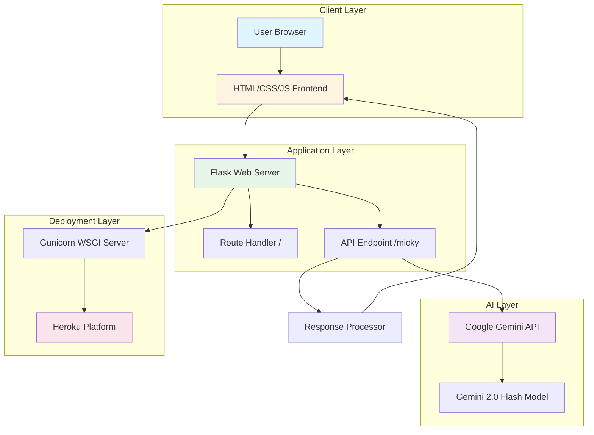

# 🤖 Micky - AI Healthcare Assistant


An intelligent AI-powered healthcare assistant that provides accurate, concise medical advice using Google's Gemini 2.0 Flash model. Micky specializes in offering medically sound responses with correct medication names, general dosages, and practical remedies.

## 📋 Table of Contents

- [Features](#-features)
- [Architecture](#-architecture)
- [Tech Stack](#-tech-stack)
- [Deployment Pipeline](#-deployment-pipeline)
- [Installation](#-installation)
- [Configuration](#-configuration)
- [Usage](#-usage)
- [API Endpoints](#-api-endpoints)
- [Project Structure](#-project-structure)
- [Contributing](#-contributing)
- [License](#-license)

## ✨ Features

- 🩺 **Medical Advice**: Provides accurate healthcare guidance for common ailments
- 💊 **Medication Recommendations**: Suggests appropriate medications with dosages
- ⚡ **Fast Responses**: Concise, 1-2 sentence medically sound answers
- 🎨 **Interactive UI**: Engaging visual interface with animated Micky character
- 🔒 **Safe & Ethical**: Follows medical ethics, avoids prescribing controlled substances
- 🌐 **Web-Based**: Accessible from any device with a web browser
- 🤖 **AI-Powered**: Leverages Google Gemini 2.0 Flash for intelligent responses

## 🏗️ Architecture



### System Flow

1. **User Interaction**: User accesses the web interface and submits a health query
2. **Frontend Processing**: JavaScript captures the query and sends POST request to `/micky`
3. **Backend Processing**: Flask receives the request and formats a specialized medical prompt
4. **AI Processing**: Google Gemini 2.0 Flash processes the query with medical context
5. **Response Generation**: AI generates concise, medically accurate advice
6. **Response Delivery**: Backend sends JSON response back to frontend
7. **UI Update**: Frontend displays the response to the user

## 🛠️ Tech Stack

### Backend
- **Python 3.10**: Core programming language
- **Flask 2.2.5**: Web framework for routing and API
- **Gunicorn 21.2.0**: Production WSGI HTTP server
- **Google Generative AI**: Integration with Gemini 2.0 Flash model

### AI/ML Libraries
- **TensorFlow 2.14+**: Deep learning framework
- **PyTorch**: Neural network library
- **Transformers**: State-of-the-art NLP models
- **Scikit-learn**: Machine learning utilities
- **NumPy**: Numerical computing
- **Pandas**: Data manipulation
- **SciPy**: Scientific computing

### Frontend
- **HTML5**: Structure and content
- **CSS3**: Styling and animations
- **JavaScript (ES6+)**: Interactive functionality

### Additional Dependencies
- **Flask-CORS**: Cross-Origin Resource Sharing
- **Flask-SocketIO**: WebSocket support
- **Protobuf**: Protocol buffer support
- **Requests**: HTTP library
- **Matplotlib**: Data visualization

## 🚀 Deployment Pipeline


### Deployment Steps

1. **Source Control**: Code pushed to GitHub repository
2. **Platform Detection**: Heroku detects Python application via `runtime.txt` and `requirements.txt`
3. **Dependency Installation**: `pip install -r requirements.txt` executed
4. **Environment Configuration**: Environment variables loaded (GEMINI_API_KEY, PORT)
5. **Process Startup**: Gunicorn starts as defined in `Procfile`
6. **Health Check**: Heroku verifies application is responding
7. **Traffic Routing**: Application receives production traffic

### Deployment Configuration

- **Procfile**: `web: gunicorn -b 0.0.0.0:$PORT app:app`
- **Runtime**: Python 3.10
- **Port**: Dynamic (assigned by Heroku via $PORT environment variable)
- **Worker**: Gunicorn WSGI server

## 📦 Installation

### Prerequisites

- Python 3.10 or higher
- pip (Python package manager)
- Google Gemini API key

### Local Setup

1. **Clone the repository**
   ```bash
   git clone https://github.com/lavansh1306/Micky.git
   cd Micky
   ```

2. **Create virtual environment**
   ```bash
   python -m venv venv
   source venv/bin/activate  # On Windows: venv\Scripts\activate
   ```

3. **Install dependencies**
   ```bash
   pip install -r requirements.txt
   ```

4. **Set up environment variables**
   ```bash
   export GEMINI_API_KEY="your_gemini_api_key_here"
   export PORT=8080  # Optional, defaults to 8080
   ```

5. **Run the application**
   ```bash
   python app.py
   ```

6. **Access the application**
   Open your browser and navigate to `http://localhost:8080`

## ⚙️ Configuration

### Environment Variables

| Variable | Description | Required | Default |
|----------|-------------|----------|---------|
| `GEMINI_API_KEY` | Google Gemini API key for AI functionality | Yes | None |
| `PORT` | Port number for the application | No | 8080 |

### Getting a Gemini API Key

1. Visit [Google AI Studio](https://aistudio.google.com/app/apikey)
2. Sign in with your Google account
3. Create a new API key
4. Copy the key and set it as an environment variable

## 💻 Usage

### Web Interface

1. Open the application in your web browser
2. Click the "Talk to Micky" button
3. Speak or type your health-related question
4. Receive concise, medically accurate advice

### Example Queries

- "I have a headache and nausea"
- "I have a fever, what should I do?"
- "What medicine works for cold and cough?"
- "I have acid reflux, what helps?"
- "What should I do for food poisoning?"

### Example Responses

- **Query**: "I have a headache and nausea"
  **Response**: "Take paracetamol 500mg, stay hydrated, and rest in a dark room."

- **Query**: "I have a fever, what should I do?"
  **Response**: "Take paracetamol 650mg every 6 hours, drink fluids, and monitor your temperature."

## 🔌 API Endpoints

### `GET /`
Returns the main HTML interface.

**Response**: HTML page

### `POST /micky`
Processes health queries and returns AI-generated medical advice.

**Request Body**:
```json
{
  "query": "I have a headache"
}
```

**Response**:
```json
{
  "response": "Take paracetamol 500mg, stay hydrated, and rest in a dark room."
}
```

**Status Codes**:
- `200 OK`: Successful response
- `400 Bad Request`: Invalid request format
- `500 Internal Server Error`: Server or AI processing error

## 📁 Project Structure

```
Micky/
├── app.py                  # Main Flask application
├── requirements.txt        # Python dependencies
├── runtime.txt            # Python version specification
├── Procfile               # Heroku deployment configuration
├── README.md              # Project documentation
├── docs/
│   └── architecture.svg   # System architecture diagram
├── templates/
│   └── index.html         # Main HTML interface
└── static/
    ├── css/
    │   └── styles.css     # Styling and animations
    │   └── styles.css     # Application styling
    └── js/
        └── script.js      # Frontend JavaScript logic
```

## 🤝 Contributing

Contributions are welcome! Please follow these steps:

1. Fork the repository
2. Create a feature branch (`git checkout -b feature/AmazingFeature`)
3. Commit your changes (`git commit -m 'Add some AmazingFeature'`)
4. Push to the branch (`git push origin feature/AmazingFeature`)
5. Open a Pull Request

### Development Guidelines

- Follow PEP 8 style guide for Python code
- Write clear, descriptive commit messages
- Add comments for complex logic
- Test thoroughly before submitting PR
- Ensure medical advice remains safe and ethical

## ⚠️ Disclaimer

**Important**: Micky is an AI assistant designed to provide general health information and guidance. It is **not a substitute for professional medical advice, diagnosis, or treatment**. Always consult with a qualified healthcare provider for serious medical conditions or before starting any medication.

## 📄 License

This project is open source. Please check with the repository owner for licensing information.

## 👨‍💻 Author

**Lavansh1306**
- GitHub: [@lavansh1306](https://github.com/lavansh1306)

## 🙏 Acknowledgments

- Google Gemini AI for powering the intelligent responses
- Flask community for the excellent web framework
- Open source contributors to all dependencies

---

Made with ❤️ by Lavansh1306
